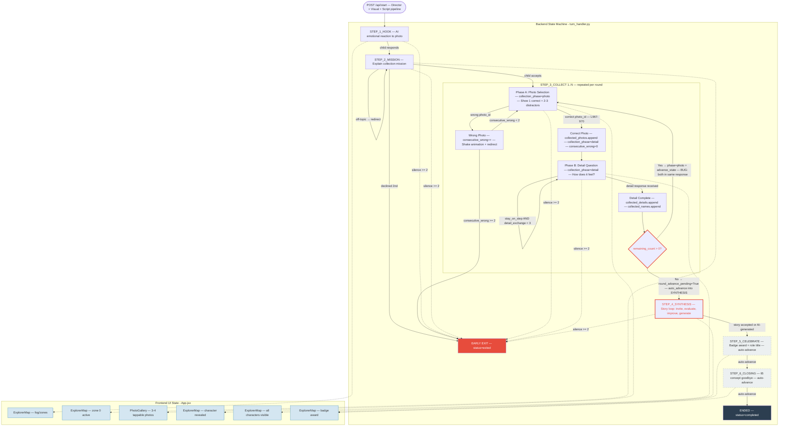
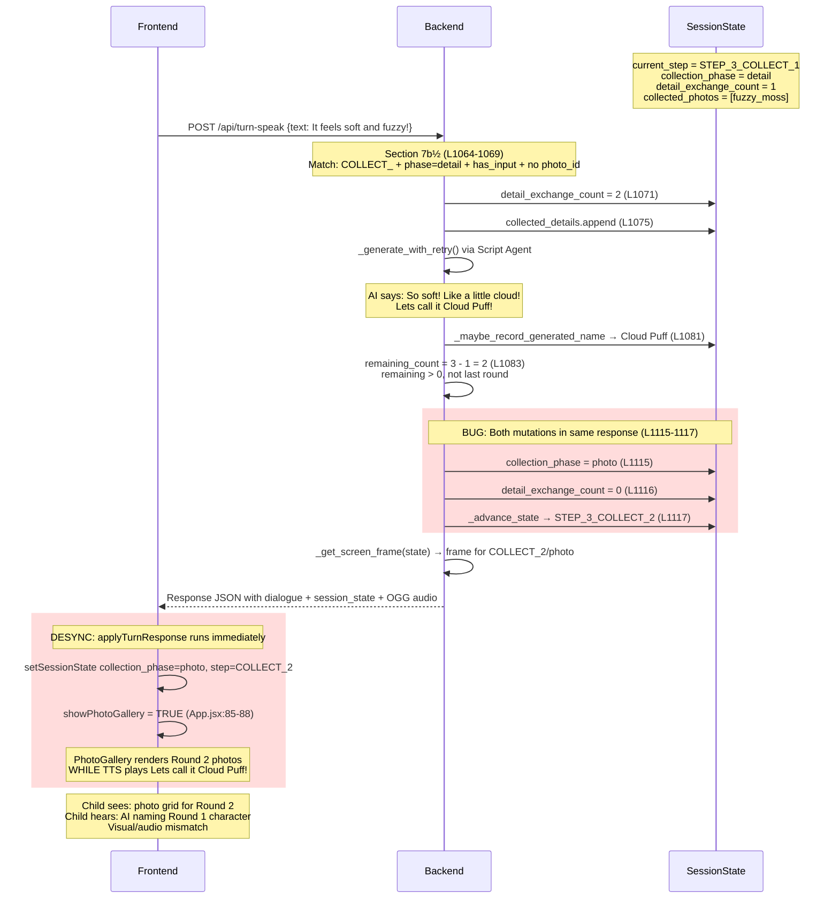
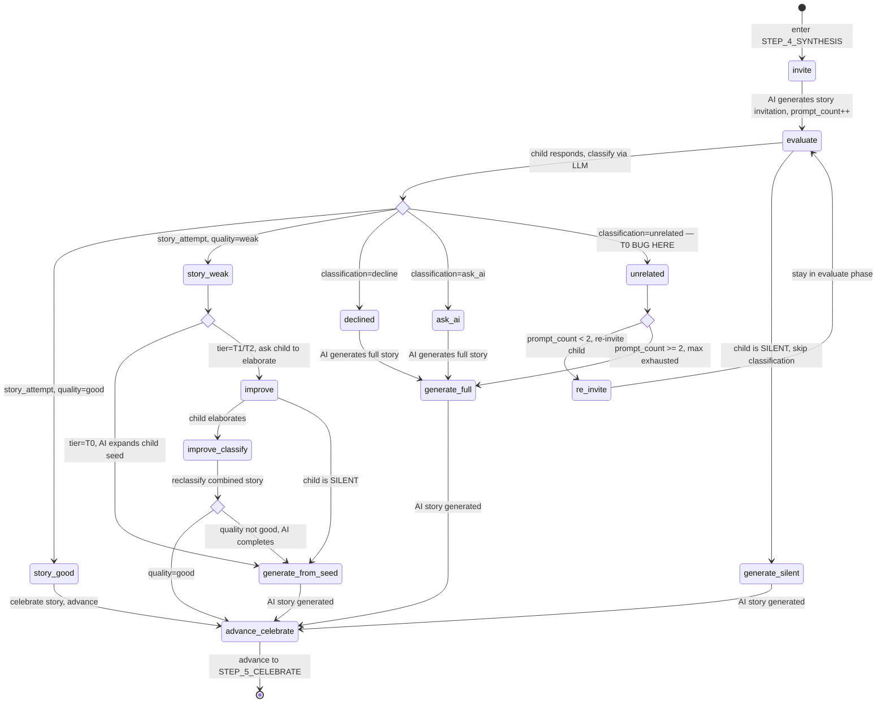

# Cat5 Workflow Diagnosis — Full Mermaid Diagrams

Two known issues in the Cat5 (out-of-device collection) game flow:
1. **Collection phase desync** — AI dialogue references the current round's detail while the screen already shows the next round's photo grid
2. **Synthesis classification too strict** — Short T0 stories (ages 2-4) misclassified as "unrelated" instead of "story_attempt(weak)"

---

## Diagram 1: Full Cat5 Backbone

End-to-end state machine showing all 6 steps, edge cases, and frontend UI switching.



**Frontend switching condition** (App.jsx:85-88):
```js
showPhotoGallery = templateType === 'cat5'
  && current_step.startsWith('STEP_3_COLLECT_')
  && collection_phase !== 'detail'
  && isActive;
```

---

## Diagram 2: Collection Phase Desync (Issue 1)

Shows the exact race condition when Phase B completes and the backend returns both the naming dialogue AND the next round's state in one response.



**Root cause:** `turn_handler.py:1115-1117` sets `collection_phase = "photo"` and calls `_advance_state()` before returning the response. The frontend applies session state immediately on receipt, before TTS finishes playing.

**Possible fixes (recommended → least disruptive):**
1. **Keep `collection_phase = "detail"`** in this response, return `auto_advance = True`, let the next empty turn flip to photo mode — cleanest separation but adds a round trip
2. **Add a `ui_phase` field** decoupled from the state machine that the frontend uses for rendering — more flexible but adds complexity
3. **Frontend delays `showPhotoGallery`** flip until TTS playback completes via `handleSpeakingDone` — frontend-only fix but fragile if TTS is muted

---

## Diagram 3: Synthesis Loop State Machine (Issue 2)

Shows the full STEP_4_SYNTHESIS sub-state machine with classification routing and the T0 misclassification bug.



**Bug zone:** The `unrelated → prompt_check → re_invite` path (highlighted above) is where T0 short stories get trapped.

**Classification prompt** (turn_handler.py:537-552):
```
"story_attempt": ANY narrative content (even single sentence like 'the dog went to sleep').
  quality "good": 2+ story elements (character + action, or action + outcome)
  quality "weak": single sentence with no progression
```

**The bug:** For T0 children (ages 2-4), typical responses are:
- "the fuzzy moss went to sleep" (1 character + 1 action → should be "weak" at minimum)
- "cloud puff is soft" (character + attribute → borderline)

The LLM classifier may see these as too short to be narrative and classify as `"unrelated"` instead of `"story_attempt(weak)"`. This triggers re-invites (up to 2) which confuse a 2-year-old.

Additionally, the **exception fallback** (line 581) defaults to `"unrelated"`, meaning any LLM failure during classification also triggers the re-invite loop.

**Possible fixes (recommended → least disruptive):**
1. **For T0, skip classification entirely** — treat any non-silent/non-decline response as a story seed for AI expansion (line 845-849 already handles T0 weak → generate, so we just need to always reach that path)
2. **Add tier context to prompt:** "For T0 (ages 2-4), even 3-word responses mentioning a character count as story_attempt(weak)"
3. **Change exception fallback** from `"unrelated"` to `"story_attempt"` with `quality="weak"` — fail-safe toward acceptance rather than rejection
